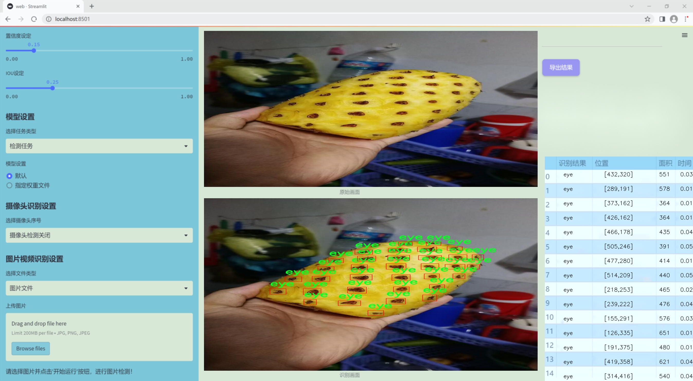
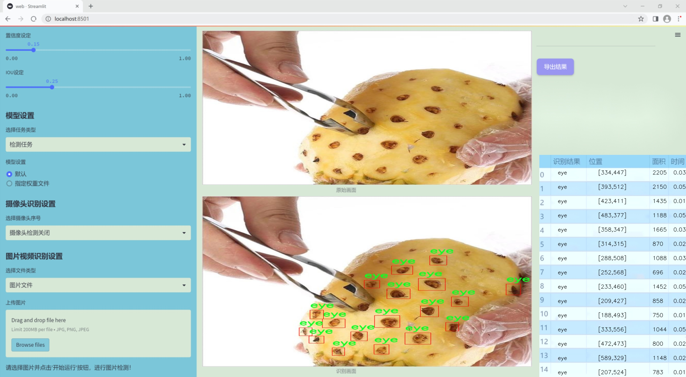
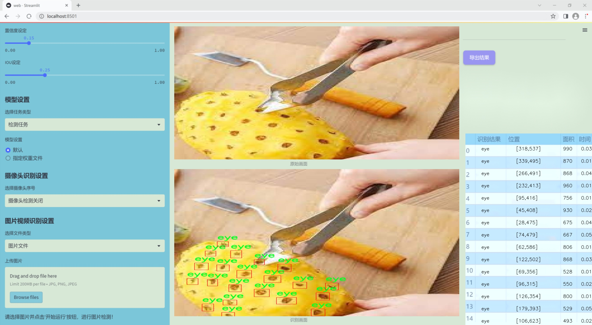
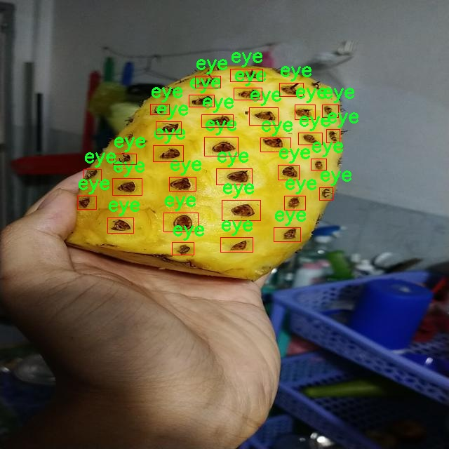
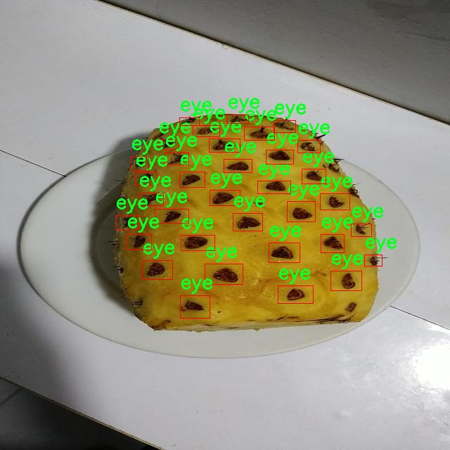
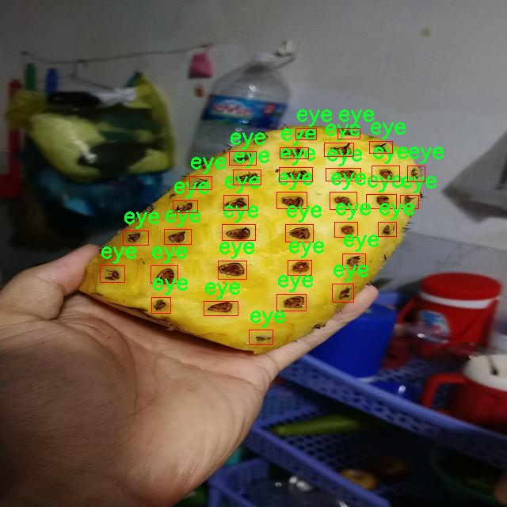
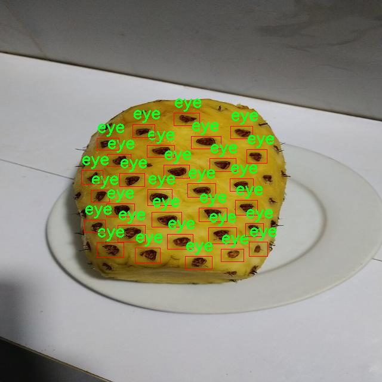
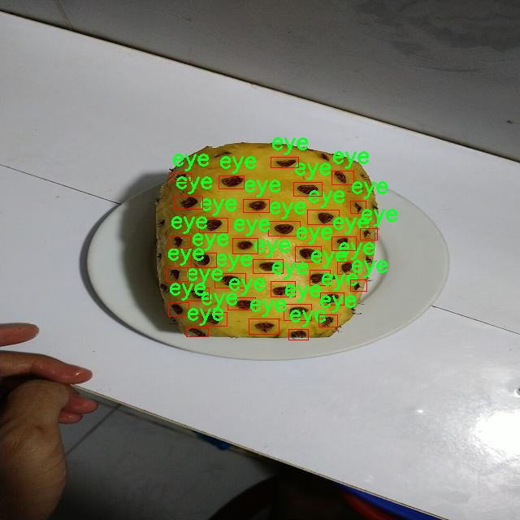

### 1.背景意义

研究背景与意义

随着全球食品加工行业的快速发展，自动化和智能化技术在提升生产效率和产品质量方面发挥着越来越重要的作用。在这一背景下，计算机视觉技术的应用逐渐成为食品加工领域的重要趋势。特别是在水果加工行业，如何高效、准确地检测和分类产品的质量，直接关系到生产效率和市场竞争力。菠萝作为一种广受欢迎的热带水果，其加工过程中的眼检测（即菠萝表面的小孔洞）是确保产品质量的重要环节。眼的存在不仅影响菠萝的外观，还可能影响其口感和保存期限，因此，开发一个高效的眼检测系统显得尤为重要。

本研究旨在基于改进的YOLOv11模型，构建一个针对菠萝加工线的眼检测系统。YOLO（You Only Look Once）系列模型因其高效的实时检测能力和较高的准确率而广泛应用于各种计算机视觉任务。通过对YOLOv11的改进，我们希望能够进一步提升其在菠萝眼检测中的性能。为此，我们使用了一个包含42张图像的数据集，数据集中仅包含一个类别“eye”，这为模型的训练和评估提供了明确的目标。

在数据集的处理过程中，我们对图像进行了自动方向调整和尺寸统一，确保模型在训练时能够获得一致的输入。这种简化的数据处理方式，虽然未采用图像增强技术，但通过精确的标注和合理的预处理，仍然能够为模型的学习提供良好的基础。最终，我们期望通过该系统的开发，不仅能提高菠萝加工的自动化水平，还能为相关领域的研究提供参考，推动计算机视觉技术在食品加工行业的进一步应用与发展。

### 2.视频效果

[2.1 视频效果](https://www.bilibili.com/video/BV1ZRSNY5E2M/)

### 3.图片效果







##### [项目涉及的源码数据来源链接](https://kdocs.cn/l/cszuIiCKVNis)**

注意：本项目提供训练的数据集和训练教程,由于版本持续更新,暂不提供权重文件（best.pt）,请按照6.训练教程进行训练后实现上图演示的效果。

### 4.数据集信息

##### 4.1 本项目数据集类别数＆类别名

nc: 1
names: ['eye']


该项目为【目标检测】数据集，请在【训练教程和Web端加载模型教程（第三步）】这一步的时候按照【目标检测】部分的教程来训练

##### 4.2 本项目数据集信息介绍

本项目数据集信息介绍

本项目旨在开发一个改进版的YOLOv11模型，以实现菠萝加工线上的眼检测系统。为此，我们构建了一个专门的数据集，聚焦于菠萝的眼部特征，确保模型能够准确识别和定位菠萝的眼。该数据集包含了大量的菠萝图像，所有图像均经过精心挑选和标注，以确保其在训练过程中的有效性和可靠性。数据集中只包含一个类别，即“eye”，这一类别专门针对菠萝的眼部特征进行标注，确保模型能够专注于这一特定的检测任务。

在数据集的构建过程中，我们综合考虑了菠萝的不同生长阶段、不同品种以及不同的光照和背景条件，以提高模型的泛化能力。数据集中的图像涵盖了菠萝的多种角度和姿态，力求为模型提供丰富的视觉信息，从而增强其在实际应用中的表现。此外，为了确保数据集的多样性，我们还包括了在不同环境下拍摄的菠萝图像，如室内和室外场景，以模拟真实的加工线环境。

在标注过程中，我们采用了严格的质量控制措施，确保每一张图像中的眼部特征都被准确标记。这种高质量的标注不仅为模型的训练提供了坚实的基础，也为后续的评估和优化提供了可靠的数据支持。通过这一数据集的训练，我们期望能够显著提升YOLOv11在菠萝眼检测任务中的准确性和效率，从而为菠萝加工行业的自动化和智能化发展贡献力量。











### 5.全套项目环境部署视频教程（零基础手把手教学）

[5.1 所需软件PyCharm和Anaconda安装教程（第一步）](https://www.bilibili.com/video/BV1BoC1YCEKi/?spm_id_from=333.999.0.0&vd_source=bc9aec86d164b67a7004b996143742dc)


[5.2 安装Python虚拟环境创建和依赖库安装视频教程（第二步）](https://www.bilibili.com/video/BV1ZoC1YCEBw?spm_id_from=333.788.videopod.sections&vd_source=bc9aec86d164b67a7004b996143742dc)

### 6.改进YOLOv11训练教程和Web_UI前端加载模型教程（零基础手把手教学）

[6.1 改进YOLOv11训练教程和Web_UI前端加载模型教程（第三步）](https://www.bilibili.com/video/BV1BoC1YCEhR?spm_id_from=333.788.videopod.sections&vd_source=bc9aec86d164b67a7004b996143742dc)


按照上面的训练视频教程链接加载项目提供的数据集，运行train.py即可开始训练



     Epoch   gpu_mem       box       obj       cls    labels  img_size
     1/200     20.8G   0.01576   0.01955  0.007536        22      1280: 100%|██████████| 849/849 [14:42<00:00,  1.04s/it]
               Class     Images     Labels          P          R     mAP@.5 mAP@.5:.95: 100%|██████████| 213/213 [01:14<00:00,  2.87it/s]
                 all       3395      17314      0.994      0.957      0.0957      0.0843

     Epoch   gpu_mem       box       obj       cls    labels  img_size
     2/200     20.8G   0.01578   0.01923  0.007006        22      1280: 100%|██████████| 849/849 [14:44<00:00,  1.04s/it]
               Class     Images     Labels          P          R     mAP@.5 mAP@.5:.95: 100%|██████████| 213/213 [01:12<00:00,  2.95it/s]
                 all       3395      17314      0.996      0.956      0.0957      0.0845

     Epoch   gpu_mem       box       obj       cls    labels  img_size
     3/200     20.8G   0.01561    0.0191  0.006895        27      1280: 100%|██████████| 849/849 [10:56<00:00,  1.29it/s]
               Class     Images     Labels          P          R     mAP@.5 mAP@.5:.95: 100%|███████   | 187/213 [00:52<00:00,  4.04it/s]
                 all       3395      17314      0.996      0.957      0.0957      0.0845


###### [项目数据集下载链接](https://kdocs.cn/l/cszuIiCKVNis)

### 7.原始YOLOv11算法讲解

YOLOv11是一种由Ultralytics公司开发的最新一代目标检测模型，以其增强的特征提取能力和更高的效率在计算机视觉领域引人注目。该模型在架构上进行了关键升级，通过更新主干和颈部结构，显著提高了对复杂视觉场景的理解和处理精度。YOLOv11不仅在目标检测上表现出色，还支持实例分割、图像分类、姿态估计和定向目标检测（OBB）等任务，展示出其多功能性。

与其前身YOLOv8相比，YOLOv11在设计上实现了深度和宽度的改变，同时引入了几个创新机制。其中，C3k2机制是对YOLOv8中的C2f的改进，提升了浅层特征的处理能力；C2PSA机制则进一步优化了特征图的处理流程。解耦头的创新设计，通过增加两个深度卷积（DWConv），提高了模型对细节的感知能力和分类准确性。

在性能上，YOLOv11m模型在COCO数据集上的平均精度（mAP）提高，并减少了22%的参数量，确保了在运算效率上的突破。该模型可以部署在多种平台上，包括边缘设备、云平台以及支持NVIDIA GPU的系统，彰显出卓越的灵活性和适应性。总体而言，YOLOv11通过一系列的创新突破，对目标检测领域产生了深远的影响，并为未来的开发提供了新的研究方向。


****文档**** ： _ _https://docs.ultralytics.com/models/yolo11/__

****代码链接**** ： _ _https://github.com/ultralytics/ultralytics__

******Performance Metrics******


​ ** **关键特性****

****◆**** ** **增强的特征提取能力**** ：YOLO11采用了改进的主干和颈部架构，增强了 ** **特征提取****
能力，能够实现更精确的目标检测和复杂任务的执行。

****◆**** ** **优化的效率和速度****
：YOLO11引入了精细化的架构设计和优化的训练流程，提供更快的处理速度，并在准确性和性能之间保持最佳平衡。

****◆**** ** **参数更少、精度更高****
：通过模型设计的改进，YOLO11m在COCO数据集上实现了更高的平均精度（mAP），同时使用的参数比YOLOv8m少22%，使其在计算上更加高效，而不牺牲准确性。

****◆**** ** **跨环境的适应性**** ：YOLO11可以无缝部署在各种环境中，包括边缘设备、云平台和支持NVIDIA
GPU的系统，确保最大的灵活性。

****◆**** ** **支持广泛任务****
：无论是目标检测、实例分割、图像分类、姿态估计还是定向目标检测（OBB），YOLO11都旨在应对一系列计算机视觉挑战。

****支持的任务和模式****


​YOLO11建立在YOLOv8中引入的多功能模型范围之上，为各种计算机视觉任务提供增强的支持:


​该表提供了YOLO11模型变体的概述，展示了它们在特定任务中的适用性以及与Inference、Validation、Training和Export等操作模式的兼容性。从实时检测到复杂的分割任务
，这种灵活性使YOLO11适用于计算机视觉的广泛应用。

##### yolov11的创新

■ yolov8 VS yolov11

YOLOv5，YOLOv8和YOLOv11均是ultralytics公司的作品，ultralytics出品必属精品。


​ **具体创新点** ：

**① 深度（depth）和宽度 （width）**

YOLOv8和YOLOv11是基本上完全不同。

**② C3k2机制**

C3k2有参数为c3k，其中在网络的浅层c3k设置为False。C3k2就相当于YOLOv8中的C2f。


​ **③ C2PSA机制**

下图为C2PSA机制的原理图。


​ **④ 解耦头**

解耦头中的分类检测头增加了两个 **DWConv** 。


▲Conv

    
    
    def autopad(k, p=None, d=1):  # kernel, padding, dilation
    
        """Pad to 'same' shape outputs."""
    
        if d > 1:
    
            k = d * (k - 1) + 1 if isinstance(k, int) else [d * (x - 1) + 1 for x in k]  # actual kernel-size
    
        if p is None:
    
            p = k // 2 if isinstance(k, int) else [x // 2 for x in k]  # auto-pad
    
    return p
    
    
    class Conv(nn.Module):
    
        """Standard convolution with args(ch_in, ch_out, kernel, stride, padding, groups, dilation, activation)."""
    
    
        default_act = nn.SiLU()  # default activation
    
    
        def __init__(self, c1, c2, k=1, s=1, p=None, g=1, d=1, act=True):
    
            """Initialize Conv layer with given arguments including activation."""
    
            super().__init__()
    
            self.conv = nn.Conv2d(c1, c2, k, s, autopad(k, p, d), groups=g, dilation=d, bias=False)
    
            self.bn = nn.BatchNorm2d(c2)
    
            self.act = self.default_act if act is True else act if isinstance(act, nn.Module) else nn.Identity()
    
    
        def forward(self, x):
    
            """Apply convolution, batch normalization and activation to input tensor."""
    
            return self.act(self.bn(self.conv(x)))
    
    
        def forward_fuse(self, x):
    
            """Perform transposed convolution of 2D data."""
    
            return self.act(self.conv(x))

▲Conv2d

    
    
    torch.nn.Conv2d(in_channels, out_channels, kernel_size, stride=1, padding=0, dilation=1, groups=1, bias=True, padding_mode='zeros')

▲DWConv

DWConv ** **代表 Depthwise Convolution（深度卷积）****
，是一种在卷积神经网络中常用的高效卷积操作。它主要用于减少计算复杂度和参数量。

    
    
    class DWConv(Conv):
    
        """Depth-wise convolution."""
    
    
        def __init__(self, c1, c2, k=1, s=1, d=1, act=True):  # ch_in, ch_out, kernel, stride, dilation, activation
    
            """Initialize Depth-wise convolution with given parameters."""
    
            super().__init__(c1, c2, k, s, g=math.gcd(c1, c2), d=d, act=act)


### 8.200+种全套改进YOLOV11创新点原理讲解

#### 8.1 200+种全套改进YOLOV11创新点原理讲解大全

由于篇幅限制，每个创新点的具体原理讲解就不全部展开，具体见下列网址中的改进模块对应项目的技术原理博客网址【Blog】（创新点均为模块化搭建，原理适配YOLOv5~YOLOv11等各种版本）

[改进模块技术原理博客【Blog】网址链接](https://gitee.com/qunmasj/good)


#### 8.2 精选部分改进YOLOV11创新点原理讲解

###### 这里节选部分改进创新点展开原理讲解(完整的改进原理见上图和[改进模块技术原理博客链接](https://gitee.com/qunmasj/good)【如果此小节的图加载失败可以通过CSDN或者Github搜索该博客的标题访问原始博客，原始博客图片显示正常】

### AutoFocus: Efficient Multi-Scale Conv简介

参考该博客提出了AutoFocus，一种高效的多尺度目标检测算法。相较于以前对整个图像金字塔进行处理，该方法以一种由表及里的姿态，仅处理哪些整体上看来很有可能存在小物体的区域。这个可以通过预测一张类别未知的分割图FocusPixels来得到。为了高效利用FocusPixels，另外一个算法用于产生包含FocusPixels的FocusChips，这样可以减少计算量并处理更更精细的尺度。在不同尺度上FocusChips所得到的检测结果综合时，会出现问题，我们也提供了解决问题的方案。AutoFocus在COCO上的结果有49.7%mAP（50%重叠下68.3%），与多尺度baseline相仿但是快了2.5倍。金字塔中处理的像素数量减少了5倍mAP只下降1%，在与RetinaNet采用相同的ResNet-101结构且速度相同时，高了10%mAP。

人类寻找物体是一个动态的过程，且寻找时间与场景的复杂度是直接相关的。当我们的眼神在不同的点之间漂移时，其他的区域会被我们有意忽视。然而，现在的检测算法是一种静态的推理过程且图像金字塔中的每个像素都受到了一样的对待，这使得过程变得没有效率。现在许多的应用都不强调实时性，而计算上的节省其实可以产生很大收益。

在COCO数据集中，虽然40%的物体都是小物体，但是它们一共只占了全图的0.3%。如果金字塔是3倍关系，则在高分辨率层要进行9倍的运算。XXX 。那么有没有办法在低分辨率下找出可能含有这些物体的区域呢？

以人眼方案类比，我们可以从低分辨率图像开始，找出有可能存在物体的区域再“聚集”到高分辨率。我们的AutoFocus会在一层中计算小物体的分割图FocusPixels，而在每一个FocusPixels上会用一个算法产生下一层所需要关注的chips。在COCO的最大分辨率层上我们可以只处理**20%的像素而性能不下降，如果只处理5%**也只下降1%而已。


图像金字塔与卷积神经网络对CV十分重要。然而卷积神经网络无法做到对尺度不敏感，所以为了不同大小的物体需要依赖图像金字塔。虽然训练已经有了高效的方法，但是其推断时间依然远离实际使用标准。

目标检测加速有很长历史了。常用的有特征近似以减少尺度、级联、特征金字塔，且最后一个最近很多人研究。

AutoFocus为速度与精度之间提供了一个平滑的折衷，指出可以在低分辨率下看出小物体的所在，从而节约计算。FocusPixels的计算较为容易。

先简单介绍一下SNIP，是一种多尺度的训练、推断算法。主要思想是训练针对某个特定scale的检测器而不是scale-invariant检测器。这样训练样本就局限于在某个尺度范围内，以适于这个检测器处理。比如在高分辨率仅处理小物体而高分辨率仅处理大物体，其优势在于训练时不用考虑尺度的变化。

由于训练时物体大小是已知的，我们在图像金字塔中可以忽略大量区域而只处理物体周围的区域。SNIPER说明这样低分辨率的训练与全图训练相比并不会降低性能。同样，在推断过程中如果可以在大分辨率图像上预测可能出现小物体的chip，我们也就不用处理整张高分辨率图片。在训练时，许多物体会被裁剪、扭曲，这可以当作是一种数据扩增，然而当这个情况在推断时出现，则会产生错误，所以我们还需要一个算法来整合不同尺度上的检测结果。

#### AutoFocus框架
如SIFT、SURF等传统分类特征包含两个组件，一个detector和一个descriptor。detector只包含轻量级的操作如DoG、LoG，用于在整张图片上找到感兴趣的区域；descriptor，一般来说计算量比较大，则只需要关注那些咸兴趣的区域。这个级联结构保障了图片处理的效率。

同样，AutoFocus框架也是用于预测感兴趣的区域，并丢弃在下一尺度不可能存在物体的区域，并将裁剪和缩放后的区域传递给下一尺度。AutoFocus由三个部分组成：FocusPixels，FocusChips和focus stacking。

#### FocusPixels
FocusPixels定义在卷积网络特征图的粒度之上（如conv5），如果特征图上某个像素与小物体有重叠则标注为一个FocusPixel。（小物体：面积处于一个网络的输入范围之内）。训练过程中，FocusPixels标注为正，某些与不在面积范围内的物体有重叠的像素标注为无效，其他像素标注为负。AutoFocus的训练目标是使在FocusPixels区域产生较大的激活值。

如果同时多个物体与同一像素重叠，优先给正标注。我们的网络输入是512x512，然后a,b,c取值分别是5,64,90。对于太大或太小的物体，我们认为当前尺度上没有足够人信息进行判断，所以会标定为无效。整个网络结构如下图。训练时加两层带ReLU的卷积(3x3和1x1)以及一个二分类softmax来预测FocusPixels。


#### FocusChip生成
推断过程中，我们标注输出概率大于阈值t的像素（这个参数可以控制加速比），得到一些连通域。对于每一个域，我们做一次膨胀使其包含一些有助于识别的周围信息，膨胀后相连的部分要合并。然后，我们生成一些包含连通域的chips（不同chips可能重叠，如有重叠则合并）。有些chip可能太小缺少必要信息，并使chip的大小变化很大，为了效率我们要求保证一个最小的chip size。算法流程如下：


#### 级联推断过程
我们的过程类似于图片金字塔的推断过程但是在过程中一步步去除不关注的图片区域。我们在最低分辨率上进行检测并生成chips，然后在这些chips再进行检测和生成chips。

#### Focus Stacking
这种级联分类器的一个问题是在chip边缘本来的大物体可能生成一些被剪裁的检测目标。在下一个尺度上，由于剪裁过了，所以会检测到小的、错误的正例False Positive。之前算法中的第二步膨胀其实就是为了保证没有物体会出现在chip的边缘。这样，当我们在局部图片chip的边缘检测到物体时，就可以把这个检测结果丢弃，即使其在SNIP的范围内。

也有一些物体在图片边缘的特殊情况。如果chip和图片共享一条边的话，我们会检查检测结果的其他边是否完全在里面，如果在，则保留它，否则丢弃。

在每一尺度得到有效检测结果后，我们可以将不同尺度上的结果进行整合，将这些结果映射到原图坐标系上。最后，非极大值抑制NMS用于聚集。网络结构如之前的图片所示。


### 9.系统功能展示

图9.1.系统支持检测结果表格显示

  图9.2.系统支持置信度和IOU阈值手动调节

  图9.3.系统支持自定义加载权重文件best.pt(需要你通过步骤5中训练获得)

  图9.4.系统支持摄像头实时识别

  图9.5.系统支持图片识别

  图9.6.系统支持视频识别

  图9.7.系统支持识别结果文件自动保存

  图9.8.系统支持Excel导出检测结果数据


### 10. YOLOv11核心改进源码讲解

#### 10.1 mamba_yolo.py

以下是经过精简和注释的核心代码部分，保留了重要的功能和结构，并对每个部分进行了详细的中文注释：

```python
import torch
import torch.nn as nn
from einops import rearrange
from timm.layers import DropPath

# 自定义的二维层归一化
class LayerNorm2d(nn.Module):
    def __init__(self, normalized_shape, eps=1e-6, elementwise_affine=True):
        super().__init__()
        self.norm = nn.LayerNorm(normalized_shape, eps, elementwise_affine)

    def forward(self, x):
        # 将输入张量的维度从 (B, C, H, W) 转换为 (B, H, W, C)
        x = rearrange(x, 'b c h w -> b h w c').contiguous()
        x = self.norm(x)  # 应用层归一化
        # 再将维度转换回 (B, C, H, W)
        x = rearrange(x, 'b h w c -> b c h w').contiguous()
        return x

# 自适应填充函数，确保输出形状与输入相同
def autopad(k, p=None, d=1):
    if d > 1:
        k = d * (k - 1) + 1 if isinstance(k, int) else [d * (x - 1) + 1 for x in k]
    if p is None:
        p = k // 2 if isinstance(k, int) else [x // 2 for x in k]
    return p

# 交叉扫描功能
class CrossScan(torch.autograd.Function):
    @staticmethod
    def forward(ctx, x: torch.Tensor):
        B, C, H, W = x.shape
        ctx.shape = (B, C, H, W)
        xs = x.new_empty((B, 4, C, H * W))  # 创建新的张量
        xs[:, 0] = x.flatten(2, 3)  # 原始张量展平
        xs[:, 1] = x.transpose(dim0=2, dim1=3).flatten(2, 3)  # 转置并展平
        xs[:, 2:4] = torch.flip(xs[:, 0:2], dims=[-1])  # 翻转
        return xs

    @staticmethod
    def backward(ctx, ys: torch.Tensor):
        B, C, H, W = ctx.shape
        L = H * W
        ys = ys[:, 0:2] + ys[:, 2:4].flip(dims=[-1]).view(B, 2, -1, L)
        y = ys[:, 0] + ys[:, 1].view(B, -1, W, H).transpose(dim0=2, dim1=3).contiguous().view(B, -1, L)
        return y.view(B, -1, H, W)

# 选择性扫描核心
class SelectiveScanCore(torch.autograd.Function):
    @staticmethod
    @torch.cuda.amp.custom_fwd
    def forward(ctx, u, delta, A, B, C, D=None, delta_bias=None, delta_softplus=False, nrows=1, backnrows=1):
        # 确保输入张量是连续的
        if u.stride(-1) != 1:
            u = u.contiguous()
        if delta.stride(-1) != 1:
            delta = delta.contiguous()
        if D is not None and D.stride(-1) != 1:
            D = D.contiguous()
        if B.stride(-1) != 1:
            B = B.contiguous()
        if C.stride(-1) != 1:
            C = C.contiguous()
        ctx.delta_softplus = delta_softplus
        ctx.backnrows = backnrows
        out, x, *rest = selective_scan_cuda_core.fwd(u, delta, A, B, C, D, delta_bias, delta_softplus, 1)
        ctx.save_for_backward(u, delta, A, B, C, D, delta_bias, x)
        return out

    @staticmethod
    @torch.cuda.amp.custom_bwd
    def backward(ctx, dout):
        u, delta, A, B, C, D, delta_bias, x = ctx.saved_tensors
        du, ddelta, dA, dB, dC, dD, ddelta_bias, *rest = selective_scan_cuda_core.bwd(
            u, delta, A, B, C, D, delta_bias, dout, x, ctx.delta_softplus, 1
        )
        return (du, ddelta, dA, dB, dC, dD, ddelta_bias, None, None, None, None)

# 自定义的SS2D模块
class SS2D(nn.Module):
    def __init__(self, d_model=96, d_state=16, ssm_ratio=2.0, act_layer=nn.SiLU, dropout=0.0):
        super().__init__()
        self.in_proj = nn.Conv2d(d_model, d_model * ssm_ratio, kernel_size=1)  # 输入投影
        self.out_proj = nn.Conv2d(d_model * ssm_ratio, d_model, kernel_size=1)  # 输出投影
        self.dropout = nn.Dropout(dropout)  # Dropout层
        self.act = act_layer()  # 激活函数

    def forward(self, x: torch.Tensor):
        x = self.in_proj(x)  # 输入投影
        x = self.act(x)  # 激活
        x = self.out_proj(x)  # 输出投影
        return self.dropout(x)  # 应用Dropout

# VSSBlock_YOLO模块
class VSSBlock_YOLO(nn.Module):
    def __init__(self, in_channels: int, hidden_dim: int, drop_path: float):
        super().__init__()
        self.proj_conv = nn.Conv2d(in_channels, hidden_dim, kernel_size=1)  # 投影卷积
        self.ss2d = SS2D(d_model=hidden_dim)  # SSM模块
        self.drop_path = DropPath(drop_path)  # DropPath层

    def forward(self, input: torch.Tensor):
        input = self.proj_conv(input)  # 投影
        x = self.ss2d(input)  # SSM处理
        return self.drop_path(x)  # 应用DropPath

# 简单的Stem模块
class SimpleStem(nn.Module):
    def __init__(self, inp, embed_dim, ks=3):
        super().__init__()
        self.conv = nn.Sequential(
            nn.Conv2d(inp, embed_dim // 2, kernel_size=ks, stride=2, padding=autopad(ks)),  # 第一个卷积层
            nn.BatchNorm2d(embed_dim // 2),
            nn.GELU(),
            nn.Conv2d(embed_dim // 2, embed_dim, kernel_size=ks, stride=2, padding=autopad(ks)),  # 第二个卷积层
            nn.BatchNorm2d(embed_dim),
            nn.SiLU(),
        )

    def forward(self, x):
        return self.conv(x)  # 前向传播

# 视觉线索合并模块
class VisionClueMerge(nn.Module):
    def __init__(self, dim, out_dim):
        super().__init__()
        self.pw_linear = nn.Conv2d(dim * 4, out_dim, kernel_size=1)  # 1x1卷积用于合并

    def forward(self, x):
        # 将输入张量的不同部分进行拼接
        y = torch.cat([
            x[..., ::2, ::2],
            x[..., 1::2, ::2],
            x[..., ::2, 1::2],
            x[..., 1::2, 1::2]
        ], dim=1)
        return self.pw_linear(y)  # 合并后的输出
```

### 代码说明
1. **LayerNorm2d**: 自定义的二维层归一化模块，用于对输入的每个通道进行归一化处理。
2. **autopad**: 自适应填充函数，确保卷积操作的输出形状与输入形状相同。
3. **CrossScan**: 交叉扫描操作，主要用于处理输入张量的不同维度。
4. **SelectiveScanCore**: 选择性扫描的核心功能，包含前向和反向传播的实现。
5. **SS2D**: 自定义的时间序列处理模块，包含输入和输出的卷积投影。
6. **VSSBlock_YOLO**: 主要的模块，用于YOLO模型中的特征提取和处理。
7. **SimpleStem**: 一个简单的卷积网络结构，用于特征的初步提取。
8. **VisionClueMerge**: 用于合并不同特征图的模块。

这些核心部分保留了原始代码的主要功能，并进行了详细的中文注释，以便于理解其工作原理。

这个程序文件 `mamba_yolo.py` 是一个用于构建深度学习模型的 PyTorch 模块，主要涉及到计算机视觉领域，特别是与 YOLO（You Only Look Once）目标检测算法相关的实现。文件中定义了多个类和函数，以下是对这些内容的逐一说明。

首先，文件导入了一些必要的库，包括 `torch` 和 `torch.nn`，这些是构建神经网络的基础库。此外，还引入了一些用于张量操作的库，如 `einops` 和 `timm.layers`，后者提供了一些深度学习中常用的层。

文件中定义了一个 `LayerNorm2d` 类，这是一个二维层归一化的实现，主要用于对输入的特征图进行归一化处理。其 `forward` 方法通过调整张量的维度顺序来实现归一化。

接下来，定义了一个 `autopad` 函数，用于自动计算卷积操作所需的填充，以确保输出的特征图与输入的特征图具有相同的空间维度。

文件中还定义了多个自定义的 PyTorch 函数类，如 `CrossScan` 和 `CrossMerge`，它们实现了特定的前向和反向传播逻辑。这些类的主要作用是处理输入张量的不同维度和结构，以便在后续的网络层中进行有效的特征提取和融合。

`SelectiveScanCore` 类是一个核心的选择性扫描实现，利用 CUDA 加速进行前向和反向传播计算。这个类的设计目的是为了提高计算效率，尤其是在处理大规模数据时。

接下来，定义了一个 `cross_selective_scan` 函数，它结合了多个输入张量，利用选择性扫描机制进行特征提取。该函数的设计允许灵活地处理不同的输入和输出形状，并应用不同的归一化层。

`SS2D` 类是一个重要的模块，包含了多种参数和结构设置，支持多种前向传播方式。这个类实现了一个带有选择性扫描的卷积层，能够在处理特征图时引入额外的状态信息。

随后，定义了 `RGBlock` 和 `LSBlock` 类，这些是用于构建更复杂网络结构的基本模块。它们通过卷积操作和激活函数来处理输入特征，并在必要时引入残差连接。

`XSSBlock` 和 `VSSBlock_YOLO` 类是更高级的模块，结合了前面定义的块，构建了更复杂的网络结构。它们通过组合不同的层和操作来实现特征的提取和融合，适用于 YOLO 等目标检测任务。

`SimpleStem` 类是一个简单的特征提取模块，通常用于网络的输入部分，负责将输入图像转换为合适的特征表示。

最后，`VisionClueMerge` 类用于合并不同来源的特征图，增强网络的表达能力。它通过卷积操作将多个特征图合并为一个输出特征图。

总体而言，这个文件实现了一个复杂的深度学习模型结构，主要用于计算机视觉任务，特别是目标检测。通过定义多个模块和函数，提供了灵活的网络构建方式，能够有效地处理输入数据并提取有用的特征。

#### 10.2 afpn.py

以下是代码中最核心的部分，并添加了详细的中文注释：

```python
import torch
import torch.nn as nn
import torch.nn.functional as F
from ..modules.conv import Conv  # 导入自定义卷积模块

class BasicBlock(nn.Module):
    """基本块，包含两个卷积层和残差连接"""
    def __init__(self, filter_in, filter_out):
        super(BasicBlock, self).__init__()
        # 第一个卷积层，使用3x3卷积
        self.conv1 = Conv(filter_in, filter_out, 3)
        # 第二个卷积层，使用3x3卷积，不使用激活函数
        self.conv2 = Conv(filter_out, filter_out, 3, act=False)

    def forward(self, x):
        residual = x  # 保存输入以用于残差连接
        out = self.conv1(x)  # 通过第一个卷积层
        out = self.conv2(out)  # 通过第二个卷积层
        out += residual  # 添加残差
        return self.conv1.act(out)  # 通过激活函数返回结果


class Upsample(nn.Module):
    """上采样模块，使用1x1卷积和双线性插值"""
    def __init__(self, in_channels, out_channels, scale_factor=2):
        super(Upsample, self).__init__()
        self.upsample = nn.Sequential(
            Conv(in_channels, out_channels, 1),  # 1x1卷积
            nn.Upsample(scale_factor=scale_factor, mode='bilinear')  # 双线性插值上采样
        )

    def forward(self, x):
        return self.upsample(x)  # 执行上采样


class Downsample_x2(nn.Module):
    """2倍下采样模块"""
    def __init__(self, in_channels, out_channels):
        super(Downsample_x2, self).__init__()
        self.downsample = Conv(in_channels, out_channels, 2, 2, 0)  # 2x2卷积下采样

    def forward(self, x):
        return self.downsample(x)  # 执行下采样


class ASFF_2(nn.Module):
    """自适应特征融合模块，处理两个输入特征图"""
    def __init__(self, inter_dim=512):
        super(ASFF_2, self).__init__()
        self.inter_dim = inter_dim
        compress_c = 8  # 压缩通道数

        # 为每个输入特征图创建权重卷积
        self.weight_level_1 = Conv(self.inter_dim, compress_c, 1)
        self.weight_level_2 = Conv(self.inter_dim, compress_c, 1)
        self.weight_levels = nn.Conv2d(compress_c * 2, 2, kernel_size=1)  # 计算融合权重
        self.conv = Conv(self.inter_dim, self.inter_dim, 3)  # 融合后的卷积

    def forward(self, input1, input2):
        # 计算每个输入的权重
        level_1_weight_v = self.weight_level_1(input1)
        level_2_weight_v = self.weight_level_2(input2)

        # 合并权重并计算最终权重
        levels_weight_v = torch.cat((level_1_weight_v, level_2_weight_v), 1)
        levels_weight = self.weight_levels(levels_weight_v)
        levels_weight = F.softmax(levels_weight, dim=1)  # 归一化权重

        # 根据权重融合输入特征图
        fused_out_reduced = input1 * levels_weight[:, 0:1, :, :] + \
                            input2 * levels_weight[:, 1:2, :, :]

        out = self.conv(fused_out_reduced)  # 通过卷积层
        return out  # 返回融合后的特征图


class BlockBody_P345(nn.Module):
    """处理三个尺度特征图的模块"""
    def __init__(self, channels=[64, 128, 256, 512]):
        super(BlockBody_P345, self).__init__()

        # 定义不同尺度的卷积块
        self.blocks_scalezero1 = nn.Sequential(Conv(channels[0], channels[0], 1))
        self.blocks_scaleone1 = nn.Sequential(Conv(channels[1], channels[1], 1))
        self.blocks_scaletwo1 = nn.Sequential(Conv(channels[2], channels[2], 1))

        # 定义下采样和上采样模块
        self.downsample_scalezero1_2 = Downsample_x2(channels[0], channels[1])
        self.upsample_scaleone1_2 = Upsample(channels[1], channels[0], scale_factor=2)

        # 定义自适应特征融合模块
        self.asff_scalezero1 = ASFF_2(inter_dim=channels[0])
        self.asff_scaleone1 = ASFF_2(inter_dim=channels[1])

        # 定义更多的卷积块和下采样、上采样模块
        self.blocks_scalezero2 = nn.Sequential(
            BasicBlock(channels[0], channels[0]),
            BasicBlock(channels[0], channels[0]),
            BasicBlock(channels[0], channels[0]),
            BasicBlock(channels[0], channels[0]),
        )
        self.blocks_scaleone2 = nn.Sequential(
            BasicBlock(channels[1], channels[1]),
            BasicBlock(channels[1], channels[1]),
            BasicBlock(channels[1], channels[1]),
            BasicBlock(channels[1], channels[1]),
        )

    def forward(self, x):
        x0, x1, x2 = x  # 输入特征图

        # 通过卷积块处理输入特征图
        x0 = self.blocks_scalezero1(x0)
        x1 = self.blocks_scaleone1(x1)
        x2 = self.blocks_scaletwo1(x2)

        # 自适应特征融合
        scalezero = self.asff_scalezero1(x0, self.upsample_scaleone1_2(x1))
        scaleone = self.asff_scaleone1(self.downsample_scalezero1_2(x0), x1)

        # 继续处理
        x0 = self.blocks_scalezero2(scalezero)
        x1 = self.blocks_scaleone2(scaleone)

        return x0, x1, x2  # 返回处理后的特征图
```

以上代码展示了一个深度学习模型的基本结构，包括基本卷积块、上采样和下采样模块，以及自适应特征融合模块。每个模块都有清晰的输入输出，便于后续的特征处理和融合。

这个程序文件`afpn.py`实现了一种名为“自适应特征金字塔网络”（AFPN）的深度学习模型，主要用于计算机视觉任务，如目标检测和图像分割。代码中定义了多个类，每个类代表模型的不同组成部分。

首先，程序导入了一些必要的库，包括`torch`和`torch.nn`，以及一些自定义的模块如`Conv`和不同的块（block）。`OrderedDict`用于有序字典的存储。

`BasicBlock`类定义了一个基本的卷积块，包含两个卷积层和一个残差连接。这个设计使得网络在训练时更容易收敛。

接下来，`Upsample`和`Downsample_x2`、`Downsample_x4`、`Downsample_x8`类分别实现了上采样和不同倍数的下采样操作。这些操作在特征金字塔网络中用于调整特征图的尺寸，以便在不同的尺度上进行特征融合。

`ASFF_2`、`ASFF_3`和`ASFF_4`类实现了自适应特征融合模块（ASFF），这些模块根据输入特征图的权重进行加权融合。每个模块的构造函数中定义了权重卷积层和一个卷积层用于输出融合后的特征图。`forward`方法中计算了输入特征图的加权和，并通过卷积层进行处理。

`BlockBody_P345`和`BlockBody_P2345`类定义了特征金字塔的主体结构，分别处理3个和4个尺度的特征图。它们通过多个卷积块和自适应特征融合模块来处理输入特征图，并进行上下采样和特征融合。`forward`方法实现了特征图的前向传播过程。

`BlockBody_P345_Custom`和`BlockBody_P2345_Custom`类是上述类的自定义版本，允许用户选择不同类型的卷积块进行构建。

`AFPN_P345`和`AFPN_P2345`类是整个模型的主类，负责初始化输入和输出的卷积层，并将特征金字塔的主体结构整合在一起。它们的`forward`方法实现了输入特征图的处理流程，输出经过处理的特征图。

最后，`AFPN_P345_Custom`和`AFPN_P2345_Custom`类是对主类的扩展，允许用户自定义卷积块类型。

整体而言，这个程序文件实现了一个灵活且可扩展的特征金字塔网络，能够处理不同尺度的特征图，并通过自适应特征融合来提升模型的性能。

#### 10.3 transformer.py

以下是代码中最核心的部分，并附上详细的中文注释：

```python
import torch
import torch.nn as nn
from functools import partial

# 引入自定义的RepBN和LinearNorm模块
from .prepbn import RepBN, LinearNorm
from ..modules.transformer import TransformerEncoderLayer

# 定义一个线性归一化的快捷方式
ln = nn.LayerNorm
linearnorm = partial(LinearNorm, norm1=ln, norm2=RepBN, step=60000)

class TransformerEncoderLayer_RepBN(TransformerEncoderLayer):
    def __init__(self, c1, cm=2048, num_heads=8, dropout=0, act=..., normalize_before=False):
        # 初始化父类TransformerEncoderLayer
        super().__init__(c1, cm, num_heads, dropout, act, normalize_before)
        
        # 使用线性归一化和RepBN进行归一化
        self.norm1 = linearnorm(c1)
        self.norm2 = linearnorm(c1)

class AIFI_RepBN(TransformerEncoderLayer_RepBN):
    """定义AIFI变换器层。"""

    def __init__(self, c1, cm=2048, num_heads=8, dropout=0, act=nn.GELU(), normalize_before=False):
        """使用指定参数初始化AIFI实例。"""
        super().__init__(c1, cm, num_heads, dropout, act, normalize_before)

    def forward(self, x):
        """AIFI变换器层的前向传播。"""
        c, h, w = x.shape[1:]  # 获取输入张量的通道数、高度和宽度
        pos_embed = self.build_2d_sincos_position_embedding(w, h, c)  # 构建2D正弦余弦位置嵌入
        # 将输入张量从形状[B, C, H, W]展平为[B, HxW, C]
        x = super().forward(x.flatten(2).permute(0, 2, 1), pos=pos_embed.to(device=x.device, dtype=x.dtype))
        # 将输出张量恢复为原始形状[B, C, H, W]
        return x.permute(0, 2, 1).view([-1, c, h, w]).contiguous()

    @staticmethod
    def build_2d_sincos_position_embedding(w, h, embed_dim=256, temperature=10000.0):
        """构建2D正弦余弦位置嵌入。"""
        assert embed_dim % 4 == 0, "嵌入维度必须是4的倍数，以便进行2D正弦余弦位置嵌入"
        grid_w = torch.arange(w, dtype=torch.float32)  # 创建宽度的网格
        grid_h = torch.arange(h, dtype=torch.float32)  # 创建高度的网格
        grid_w, grid_h = torch.meshgrid(grid_w, grid_h, indexing="ij")  # 生成网格坐标
        pos_dim = embed_dim // 4  # 计算位置嵌入的维度
        omega = torch.arange(pos_dim, dtype=torch.float32) / pos_dim  # 计算频率
        omega = 1.0 / (temperature**omega)  # 根据温度调整频率

        # 计算宽度和高度的正弦余弦值
        out_w = grid_w.flatten()[..., None] @ omega[None]
        out_h = grid_h.flatten()[..., None] @ omega[None]

        # 返回组合的正弦余弦位置嵌入
        return torch.cat([torch.sin(out_w), torch.cos(out_w), torch.sin(out_h), torch.cos(out_h)], 1)[None]
```

### 代码核心部分说明：
1. **TransformerEncoderLayer_RepBN**：这个类继承自`TransformerEncoderLayer`，主要是为了在变换器中使用自定义的归一化方法（`RepBN`和`LinearNorm`）。
2. **AIFI_RepBN**：这个类是AIFI变换器层的实现，包含了前向传播方法和位置嵌入的构建方法。
3. **前向传播**：在`forward`方法中，输入张量被展平并传递给父类的前向方法，同时计算并使用位置嵌入。
4. **位置嵌入**：`build_2d_sincos_position_embedding`方法用于生成2D正弦余弦位置嵌入，确保嵌入维度是4的倍数，以便进行正弦和余弦的计算。

这个程序文件定义了一个基于Transformer架构的神经网络层，主要用于处理图像数据。文件中使用了PyTorch库，包含了一些自定义的层和功能，特别是与位置编码和归一化相关的部分。

首先，文件导入了必要的PyTorch模块和函数，包括神经网络层、激活函数等。同时，还导入了自定义的模块，如`RepBN`和`LinearNorm`，以及`TransformerEncoderLayer`和`AIFI`，这些都是构建Transformer模型的重要组成部分。

接下来，定义了一个名为`TransformerEncoderLayer_RepBN`的类，它继承自`TransformerEncoderLayer`。在这个类的构造函数中，调用了父类的构造函数，并定义了两个归一化层`norm1`和`norm2`，这两个层使用了之前导入的`linearnorm`函数，该函数结合了`LayerNorm`和`RepBN`，并设置了一个步数参数。

然后，定义了`AIFI_RepBN`类，它继承自`TransformerEncoderLayer_RepBN`，表示一个特定的Transformer层。这个类的构造函数允许用户指定多个参数，如输入通道数、隐藏层大小、注意力头数、丢弃率、激活函数和归一化选项。构造函数中同样调用了父类的构造函数。

在`AIFI_RepBN`类中，重写了`forward`方法，负责前向传播。在这个方法中，首先获取输入张量的形状，并构建二维的正弦-余弦位置编码。接着，将输入张量从形状[B, C, H, W]展平为[B, HxW, C]，并调用父类的`forward`方法进行处理，最后将输出重新排列为原始的形状[B, C, H, W]。

此外，`AIFI_RepBN`类还定义了一个静态方法`build_2d_sincos_position_embedding`，用于生成二维的正弦-余弦位置编码。该方法首先检查嵌入维度是否可以被4整除，然后创建宽度和高度的网格，并计算位置编码的值。最终返回一个包含正弦和余弦值的张量。

整体来看，这个文件实现了一个自定义的Transformer层，结合了位置编码和特定的归一化方法，适用于处理图像数据的任务。

#### 10.4 block.py

以下是经过简化和注释的核心代码部分，保留了最重要的功能和结构：

```python
import torch
import torch.nn as nn
import torch.nn.functional as F

def autopad(k, p=None, d=1):
    """自动填充以保持输出形状与输入相同。"""
    if d > 1:
        k = d * (k - 1) + 1 if isinstance(k, int) else [d * (x - 1) + 1 for x in k]  # 实际的卷积核大小
    if p is None:
        p = k // 2 if isinstance(k, int) else [x // 2 for x in k]  # 自动填充
    return p

class Conv(nn.Module):
    """自定义卷积层，包含卷积和批归一化。"""
    def __init__(self, in_channels, out_channels, kernel_size=3, stride=1, padding=None, groups=1, act=True):
        super().__init__()
        self.conv = nn.Conv2d(in_channels, out_channels, kernel_size, stride, autopad(kernel_size, padding), groups=groups, bias=False)
        self.bn = nn.BatchNorm2d(out_channels)
        self.act = nn.SiLU() if act else nn.Identity()

    def forward(self, x):
        return self.act(self.bn(self.conv(x)))

class Bottleneck(nn.Module):
    """标准瓶颈结构，包含两个卷积层。"""
    def __init__(self, c1, c2, shortcut=True, g=1, k=(3, 3), e=0.5):
        super().__init__()
        c_ = int(c2 * e)  # 隐藏通道数
        self.cv1 = Conv(c1, c_, k[0], 1)
        self.cv2 = Conv(c_, c2, k[1], 1, g=g)
        self.add = shortcut and c1 == c2

    def forward(self, x):
        """前向传播，返回加上shortcut的结果。"""
        return x + self.cv2(self.cv1(x)) if self.add else self.cv2(self.cv1(x))

class C3k(nn.Module):
    """C3k模块，包含多个瓶颈结构。"""
    def __init__(self, c1, c2, n=1, shortcut=False, g=1, e=0.5):
        super().__init__()
        self.m = nn.Sequential(*(Bottleneck(c1, c2, shortcut, g, e=e) for _ in range(n)))

    def forward(self, x):
        """前向传播，返回多个瓶颈的结果。"""
        return self.m(x)

class C3k2(nn.Module):
    """C3k2模块，包含多个C3k模块。"""
    def __init__(self, c1, c2, n=1, c3k=False, e=0.5, g=1, shortcut=True):
        super().__init__()
        self.m = nn.ModuleList(C3k(c1, c2, n, shortcut, g, e) for _ in range(n))

    def forward(self, x):
        """前向传播，返回多个C3k的结果。"""
        return torch.cat([m(x) for m in self.m], dim=1)

class FocusedLinearAttention(nn.Module):
    """聚焦线性注意力机制。"""
    def __init__(self, dim):
        super().__init__()
        self.conv1 = Conv(dim, dim, 1)
        self.conv2 = Conv(dim, dim, 1)

    def forward(self, x):
        """前向传播，计算注意力。"""
        x1 = self.conv1(x)
        x2 = self.conv2(x)
        return x1 + x2

# 其他模块和类的定义...

# 以上是核心代码部分，包含了自定义卷积、瓶颈结构、C3k和C3k2模块，以及聚焦线性注意力机制的实现。
```

### 代码注释说明：
1. **`autopad` 函数**：用于自动计算卷积的填充，以确保输出的空间维度与输入相同。
2. **`Conv` 类**：自定义卷积层，结合了卷积、批归一化和激活函数。
3. **`Bottleneck` 类**：实现了标准的瓶颈结构，包含两个卷积层和可选的shortcut连接。
4. **`C3k` 和 `C3k2` 类**：实现了多个瓶颈模块的堆叠，支持不同的通道数和shortcut连接。
5. **`FocusedLinearAttention` 类**：实现了聚焦线性注意力机制，使用了两个卷积层来计算注意力。

这段代码是一个深度学习模型的核心部分，涉及到卷积神经网络的基本构建块。

这个程序文件 `block.py` 定义了一系列用于深度学习模型的模块，主要是针对图像处理和计算机视觉任务的卷积块、注意力机制和其他相关组件。以下是对文件中主要内容的逐步说明：

首先，文件导入了必要的库，包括 PyTorch 及其相关模块，NumPy，以及一些自定义的模块和函数。这些导入为后续定义的类和函数提供了基础。

接下来，文件定义了一些基础函数，例如 `autopad` 用于自动计算卷积的填充，确保输出尺寸与输入尺寸一致。`_make_divisible` 函数用于确保某个值是可被指定除数整除的。

在类的定义中，首先定义了一些激活函数类，如 `swish`、`h_swish` 和 `h_sigmoid`，这些类实现了不同的激活函数，常用于神经网络中。

接着，文件中定义了多个卷积块和模块，例如 `DyHeadBlock` 和 `DyHeadBlockWithDCNV3`，这些模块结合了动态卷积和注意力机制，旨在提高模型的性能和灵活性。`Fusion` 类实现了不同输入特征图的融合操作。

文件中还实现了多种不同的卷积层，如 `Conv`、`DWConv`、`DSConv` 等，这些卷积层在构建神经网络时可以根据需要进行选择和组合。

在 `C3k` 和 `C3k2` 类中，定义了带有不同卷积块的层，这些层可以堆叠以形成更复杂的网络结构。它们通常包含多个卷积层和激活函数，支持残差连接以增强信息流动。

此外，文件中还实现了一些注意力机制模块，如 `CA_HSFPN` 和 `CGAFusion`，这些模块通过计算特征图的通道和空间注意力来增强特征表达能力。

文件的后半部分实现了一些更复杂的结构，如 `DynamicConv`、`GhostModule` 和 `RepViTBlock`，这些模块结合了动态卷积、轻量级卷积和视觉变换器的思想，旨在提高模型的效率和性能。

最后，文件还定义了一些特殊的模块，如 `WaveletPool` 和 `WaveletUnPool`，这些模块使用小波变换进行特征提取和重建，适用于需要多尺度特征的任务。

总的来说，`block.py` 文件实现了多种深度学习模块，旨在为图像处理和计算机视觉任务提供灵活、高效的构建块。这些模块可以组合使用，以构建复杂的神经网络架构，适应不同的任务需求。

### 11.完整训练+Web前端界面+200+种全套创新点源码、数据集获取


# [下载链接：https://mbd.pub/o/bread/Z5iZkppp](https://mbd.pub/o/bread/Z5iZkppp)